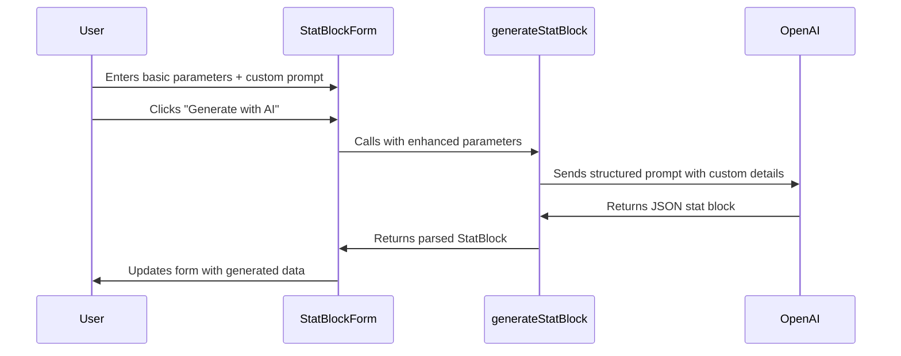

# Design Document

## Overview

This design enhances the existing AI Generated Bestiary feature by adding support for custom user prompts during monster generation. The enhancement will be implemented by modifying the StatBlockForm component to include an additional prompt input field and updating the generateStatBlock function to incorporate custom prompts into the AI generation request.

The design maintains backward compatibility with the existing functionality while providing users with greater creative control over their generated monsters.

## Architecture

The enhancement follows the existing architecture pattern:

1. **UI Layer**: StatBlockForm component handles user input and form state
2. **Action Layer**: generateStatBlock function processes the generation request
3. **AI Integration**: OpenAI API receives enhanced prompts and returns structured stat blocks

### Component Interaction Flow



## Components and Interfaces

### StatBlockForm Component Changes

**New State Variables:**
- `customPrompt: string` - Stores the user's additional prompt text

**New UI Elements:**
- Textarea component for custom prompt input
- Positioned between the basic parameters and the "Generate with AI" button
- Includes helpful placeholder text and labeling

**Form Integration:**
- Custom prompt field integrated into existing form validation
- Preserved during form state changes and edit mode transitions
- Cleared appropriately when form is reset

### generateStatBlock Function Enhancement

**Updated Function Signature:**
```typescript
export async function generateStatBlock(
    name: string,
    cr: number,
    partial: Partial<StatBlock>,
    customPrompt?: string,  // New optional parameter
    options: { apiKey: string }
): Promise<StatBlock>
```

**Enhanced Prompt Construction:**
The function will construct a more detailed prompt that combines:
1. Base parameters (name, CR, alignment, type)
2. Partial stat block details
3. Custom user prompt (when provided)

**Example Enhanced Prompt:**
```
Generate a stat block for a creature named "Shadow Drake" with a challenge rating of 5. 
Include the following details: {"alignment": "Chaotic Evil", "type": "Dragon"}

Additional requirements: This creature should have ethereal abilities, can phase through walls, 
and has a breath weapon that drains life force. It should feel mysterious and otherworldly, 
with abilities that reflect its connection to the Shadowfell.
```

## Data Models

No changes to existing data models are required. The StatBlock interface and schema remain unchanged, ensuring compatibility with existing code and data.

The custom prompt is processed at generation time and does not need to be persisted as part of the StatBlock structure.

## Error Handling

### Input Validation
- Custom prompt field accepts any text input (no specific validation required)
- Empty custom prompt is treated as valid (optional field)
- Extremely long prompts (>2000 characters) will be truncated with user warning

### API Error Handling
- Existing error handling in generateStatBlock function remains unchanged
- Custom prompt-related errors are handled through the same notification system
- Failed generations preserve the custom prompt text in the form

### User Experience
- Loading states remain consistent with current implementation
- Error messages maintain existing patterns and styling
- Custom prompt field retains its value during error states

## Testing Strategy

### Unit Tests
1. **generateStatBlock Function Tests:**
   - Test generation with custom prompt parameter
   - Test generation without custom prompt (backward compatibility)
   - Test prompt construction with various input combinations
   - Test error handling with malformed custom prompts

2. **StatBlockForm Component Tests:**
   - Test custom prompt field rendering and state management
   - Test form submission with and without custom prompts
   - Test form validation with custom prompt field
   - Test edit mode behavior with custom prompt preservation

### Integration Tests
1. **End-to-End Generation Flow:**
   - Test complete generation process with custom prompts
   - Test AI response handling with enhanced prompts
   - Test form state management throughout generation process

### User Acceptance Testing
1. **Functional Testing:**
   - Verify custom prompts influence generated stat blocks appropriately
   - Confirm backward compatibility with existing generation workflow
   - Validate error handling and user feedback mechanisms

2. **Usability Testing:**
   - Ensure custom prompt field is intuitive and well-positioned
   - Verify helpful placeholder text and labeling
   - Confirm smooth integration with existing UI flow

## Implementation Considerations

### Performance
- Custom prompt processing adds minimal overhead to existing generation
- No impact on form rendering performance
- API request size increase is negligible

### Accessibility
- Custom prompt textarea follows existing form accessibility patterns
- Proper labeling and ARIA attributes for screen readers
- Keyboard navigation support consistent with other form fields

### Backward Compatibility
- Existing generateStatBlock calls continue to work without modification
- Optional parameter design ensures no breaking changes
- Form behavior without custom prompts remains identical

### Future Extensibility
- Design allows for additional prompt enhancement features
- Prompt templates or suggestions could be added later
- Integration with prompt history or favorites is possible